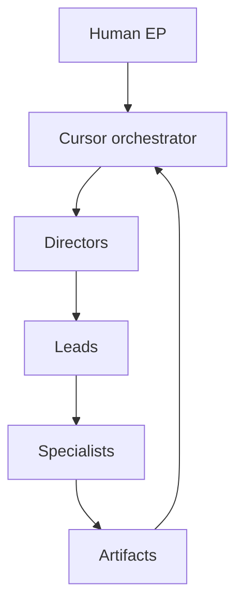

# Phase 01 — Cursor-native studio foundation

> **Work in progress — use at your own risk.** This charter describes **Cursor
> Game Studios**: a **high-fidelity structural port** of
> [Claude-Code-Game-Studios](https://github.com/Donchitos/Claude-Code-Game-Studios)
> (MIT, Donchitos). It is not a hosted engine; it is **prompt and policy
> infrastructure** for serious teams.

**Version:** 0.1.0  
**Phase:** 1 — Foundation

---

## Table of contents

1. [Executive summary](#executive-summary)
2. [What “1:1 port” means here](#what-11-port-means-here)
3. [Architecture overview](#architecture-overview)
4. [Agent hierarchy](#agent-hierarchy)
5. [Skill categories](#skill-categories)
6. [Rules surface](#rules-surface)
7. [MCP usage patterns](#mcp-usage-patterns)
8. [Unreal Engine 5.5+ stance](#unreal-engine-55-stance)
9. [Sensory covenant](#sensory-covenant)
10. [Graveyard-shift quotes](#graveyard-shift-quotes)
11. [Production seeds](#production-seeds)
12. [Risks and mitigations](#risks-and-mitigations)
13. [Delegation diagram](#delegation-diagram)
14. [Documentation spine](#documentation-spine)
15. [Phase 1 exit criteria](#phase-1-exit-criteria)
16. [Index](#index)
17. [Glossary](#glossary)
18. [Index of tables](#index-of-tables)

---

## Executive summary

**Cursor Game Studios** rebuilds the upstream studio model inside **Cursor**:
**49** subagent definitions, **72** semantic skills, and **12** `.mdc` rules. Bash
hooks from the Claude Code era are **archived for reference**, not pretended
to be identical automation. The human remains executive producer; the kit
remains a **precision instrument**, not a slot machine.

---

## What “1:1 port” means here

| Dimension | Fidelity target |
|-----------|-----------------|
| **Counts** | 49 agents, 72 skills, 11 path rules + 1 integrity rule |
| **Semantics** | Preserve upstream role boundaries and collaboration doctrine |
| **Paths** | `.claude/` → `.cursor/` for agents, skills, internal docs |
| **Execution** | Cursor-native: rules + skills + optional MCP—not a CLI twin |

---

## Architecture overview

| Layer | Location | Role |
|-------|----------|------|
| Personas | `.cursor/agents/**/*.md` | Tiered specialists |
| Workflows | `.cursor/skills/**/SKILL.md` | Multi-step SOPs |
| Policy | `.cursor/rules/*.mdc` | Scoped constraints |
| Reference | `docs/` + `.cursor/docs/` | Engine notes + studio internals |
| Regeneration | `scripts/generate-cursor-game-studios.py` | Repeatable port |

---

## Agent hierarchy

| Tier | Count | Responsibility |
|------|------:|----------------|
| Directors | 3 | Vision, technical coherence, production arbitration |
| Leads | 8 | Domain ownership across design, engineering, art, audio, narrative, QA, release, localization |
| Specialists | 38 | Implementation, audits, engine depth |

---

## Skill categories

| Category | Examples | Objective |
|----------|----------|-------------|
| Onboarding | `start`, `help` | Orient without assumptions |
| Design | `brainstorm`, `design-system` | Pillars and mechanics |
| Architecture | `create-architecture`, `architecture-decision` | ADRs and boundaries |
| Agile | `create-epics`, `sprint-plan`, `dev-story` | Delivery rhythm |
| Quality | `qa-plan`, `smoke-check` | Evidence-first testing |
| Release | `release-checklist`, `patch-notes` | Ship discipline |
| Team runs | `team-ui`, `team-combat` | Coordinated multi-role passes |

---

## Rules surface

| Rule | Intent |
|------|--------|
| `gameplay-code.mdc` | Data-driven gameplay, delta time, no UI entanglement |
| `engine-code.mdc` | Hot-path discipline in `src/core/**` |
| `network-code.mdc` | Server authority patterns |
| `cursor-game-studios-integrity.mdc` | Global port boundaries + attribution |

*(See `MANIFEST.md` for the full rule filenames.)*

---

## MCP usage patterns

| Pattern | When | Guardrail |
|---------|------|-----------|
| Editor automation | Rapid iteration | Serialize mutating calls; one writer |
| Read-only audits | QA sweeps | Prefer readonly tooling |
| Trackers | Sprint hygiene | Explicit ticket ↔ branch mapping |
| CI / packaging | Release | Never commit secrets |

---

## Unreal Engine 5.5+ stance

| Topic | Guidance |
|-------|----------|
| C++ | Systems and performance-critical paths |
| Blueprints | Designer-facing iteration; avoid unowned spaghetti |
| Rendering | Nanite/Lumen choices are project-specific—document budgets |
| Multiplayer | Authority and replication first-class |

---

## Sensory covenant

When this kit is working, your repo should feel like a **quiet control room**:
diffs are small, arguments are structured, and the only supernatural events are
**scheduled playtests**. If the room starts feeling like a séance, reduce MCP
surface area, tighten rules, and restore human sign-off.

---

## Graveyard-shift quotes

> “We ship builds, not vibes.”

> “If it is not in Git, it is fan fiction.”

> “Your one-liner ticket is a novella in disguise.”

> “The profiler is a mirror. Smile.”

> “We love crunch—when it happens to our competitors.”

> “Debuggers do not judge; they merely expose.”

> “A ‘tiny tweak’ is a dependent clause with a body count.”

> “The schedule is poetry. The milestone is prose. The hotfix is a scream.”

> “Naming is hard. Renaming is a contact sport.”

> “If two modules both own truth, you have politics, not architecture.”

> “The build farm remembers.”

> “We do not ‘try’ authority. We enforce it.”

> “Your shader compiled. Statistically, that is a miracle.”

> “Ship early, ship often, ship with receipts.”

> “The old tools can rest. We have work to do.”

---

## Production seeds

| # | Seed | First artifact |
|---|------|----------------|
| 1 | Cold open | `production/review-mode.txt` via `start` skill |
| 2 | Pillars | GDD pillar template |
| 3 | Concept | `design/gdd/game-concept.md` |
| 4 | Architecture | ADR |
| 5 | Epics | `create-epics` skill |
| 6 | Sprint | `sprint-plan` skill |
| 7 | Slice | `dev-story` skill |
| 8 | UI swarm | `team-ui` skill |
| 9 | Combat | `team-combat` skill |
| 10 | Narrative | `team-narrative` skill |
| 11 | Audio | `team-audio` skill |
| 12 | QA gate | `qa-plan` + `smoke-check` |
| 13 | Performance | `perf-profile` skill |
| 14 | Release | `release-checklist` skill |
| 15 | Retro | `retrospective` skill |

---

## Risks and mitigations

| Risk | Mitigation |
|------|------------|
| Parallel editor mutation races | Serialize MCP writes |
| Rule overload | Avoid gratuitous `alwaysApply` |
| Drift from upstream | Regenerate via script; diff intentionally |
| Contamination | Integrity tests ban known stray tokens |

---

## Delegation diagram

---

## Documentation spine

| File | Role |
|------|------|
| `README.md` | Entry + WIP warning |
| `AGENTS.md` | Studio law |
| `MANIFEST.md` | Inventory |
| `ROADMAP.md` | Ten phases |
| `docs/index.md` | Public doc hub |

---

## Phase 1 exit criteria

| Criterion | Status |
|-----------|--------|
| 49 agents | Required |
| 72 skills | Required |
| 12 rules | Required |
| Legal spine | Required |
| Integrity tests | Required |

---

## Index

- **1:1 meaning:** [What “1:1 port” means here](#what-11-port-means-here)
- **Agents:** [Agent hierarchy](#agent-hierarchy)
- **MCP:** [MCP usage patterns](#mcp-usage-patterns)
- **Phase 1:** [Phase 1 exit criteria](#phase-1-exit-criteria)
- **Rules:** [Rules surface](#rules-surface)
- **Skills:** [Skill categories](#skill-categories)
- **Unreal:** [Unreal Engine 5.5+ stance](#unreal-engine-55-stance)

---

## Glossary

| Term | Definition |
|------|------------|
| ADR | Architecture Decision Record |
| Agent | Subagent definition (`.md` under `.cursor/agents/`) |
| Cursor | Agentic IDE hosting rules and skills |
| Director | Tier-1 persona |
| EP | Executive producer (human) |
| GDD | Game Design Document |
| Glob | File pattern for rule attachment |
| Lead | Tier-2 domain owner |
| MCP | Model Context Protocol |
| Skill | `SKILL.md` workflow playbook |
| Specialist | Tier-3 implementer |
| UE5 | Unreal Engine 5 |
| Upstream | Donchitos/Claude-Code-Game-Studios |

---

## Index of tables

| Table | Section |
|-------|---------|
| 1:1 meaning | [What “1:1 port” means here](#what-11-port-means-here) |
| Architecture | [Architecture overview](#architecture-overview) |
| Agents | [Agent hierarchy](#agent-hierarchy) |
| Skills | [Skill categories](#skill-categories) |
| Rules | [Rules surface](#rules-surface) |
| MCP | [MCP usage patterns](#mcp-usage-patterns) |
| UE5 | [Unreal Engine 5.5+ stance](#unreal-engine-55-stance) |
| Production seeds | [Production seeds](#production-seeds) |
| Risks | [Risks and mitigations](#risks-and-mitigations) |
| Exit criteria | [Phase 1 exit criteria](#phase-1-exit-criteria) |
| Glossary | [Glossary](#glossary) |

---

## Attribution

Upstream: [Claude-Code-Game-Studios](https://github.com/Donchitos/Claude-Code-Game-Studios) (MIT, Donchitos).
