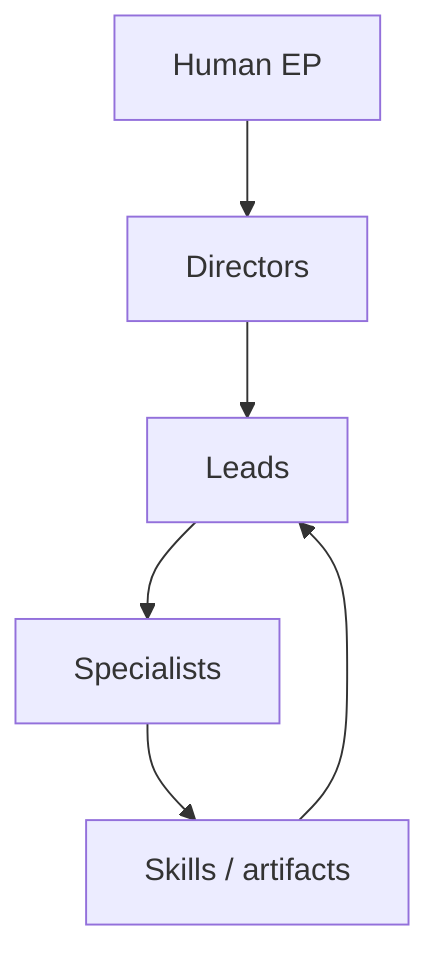

# Phase 02 — Agent and skill deepening

> **Work in progress — use at your own risk.** Phase 2 increases **operational
> power** without breaking the **1:1 structural port** of
> [Claude-Code-Game-Studios](https://github.com/Donchitos/Claude-Code-Game-Studios):
> counts stay **49 / 72 / 12**; deepening is **additive** (see `<!-- PHASE2_DEEPENING_BEGIN -->` markers).

**Version:** 0.2.0  
**Phase:** 2 — Deepening

---

## Table of contents

1. [Executive summary](#executive-summary)
2. [What changed in Phase 2](#what-changed-in-phase-2)
3. [Studio role profiles (twelve)](#studio-role-profiles-twelve)
4. [Agent specialization matrix](#agent-specialization-matrix)
5. [Skill complexity and orchestration](#skill-complexity-and-orchestration)
6. [MCP posture recap](#mcp-posture-recap)
7. [Failure modes (org-level)](#failure-modes-org-level)
8. [Sensory covenant — late-night build](#sensory-covenant--late-night-build)
9. [Graveyard quotes](#graveyard-quotes)
10. [Production workflow seeds](#production-workflow-seeds)
11. [Evolution hooks (Phase 3+)](#evolution-hooks-phase-3)
12. [Delegation diagram](#delegation-diagram)
13. [Index](#index)
14. [Glossary](#glossary)
15. [Index of tables](#index-of-tables)

---

## Executive summary

Phase 2 makes Cursor Game Studios **meaner in the good way**: sharper handoffs,
clearer MCP gates, and **spawn-ready** templates appended to every agent and
skill. A parallel **`skills/`** reference tree gives categorized navigation;
**doctrine** and **orchestration** docs explain how to run the studio without
accidentally summoning a parallel reality where nobody owns the merge conflict.

---

## What changed in Phase 2

| Deliverable | Location |
|-------------|----------|
| Agent deepening | `.cursor/agents/**` (Phase 2 appendix per file) |
| Skill deepening | `.cursor/skills/**/SKILL.md` (Phase 2 appendix) |
| Categorized skill companions | `skills/<category>/*.md` + `skills/index.md` |
| Affinity matrix | `docs/agent-skill-affinity-matrix.md` |
| Orchestration patterns | `docs/orchestration-patterns.md` |
| Operating doctrine | `docs/studio-operating-doctrine.md` |
| Generator | `scripts/phase2-deepen.py` |

---

## Studio role profiles (twelve)

Each profile maps to **existing agents** (no new headcount on disk—power is
**clarity**, not file inflation).

### 1 — Lead Unreal engineer (cluster)

**Agents:** `unreal-specialist`, `ue-gas-specialist`, `ue-blueprint-specialist`,
`ue-replication-specialist`, `ue-umg-specialist`  
**Mission:** Keep UE5.5+ shipping lanes honest: C++ core, Blueprint boundaries,
replication truth, UI ownership.  
**MCP stance:** Editor automation is a **luxury scalpel**—serialize mutations.

### 2 — Systems stitch lead

**Agents:** `lead-programmer`, `engine-programmer`, `gameplay-programmer`  
**Mission:** Turn architecture into code without “temporary” permanence.

### 3 — MCP orchestration specialist

**Agents:** `devops-engineer`, `tools-programmer`  
**Mission:** Tooling that fails closed: timeouts, logs, least privilege.

### 4 — World builder

**Agents:** `world-builder`, `level-designer`, `technical-artist`  
**Mission:** Space players believe; performance budgets included.

### 5 — QA director (cluster)

**Agents:** `qa-lead`, `qa-tester`  
**Mission:** Evidence beats vibes; flakiness is a defect, not weather.

### 6 — Technical truth czar

**Agent:** `technical-director`  
**Mission:** Resolve cross-domain technical conflict with written decisions.

### 7 — Player fantasy guardian

**Agents:** `creative-director`, `game-designer`  
**Mission:** Pillars stay coherent when scope tries to negotiate with reality.

### 8 — Live ops field medic

**Agents:** `live-ops-designer`, `release-manager`  
**Mission:** Hotfixes with dignity; telemetry-informed patches.

### 9 — Narrative systems engineer

**Agents:** `narrative-director`, `writer`  
**Mission:** Lore that ships in **data**, not only vibes.

### 10 — Performance anesthesiologist

**Agent:** `performance-analyst`  
**Mission:** Kill spikes before they become culture.

### 11 — Accessibility sentinel

**Agents:** `accessibility-specialist`, `ux-designer`  
**Mission:** Input, readability, and assist patterns as first-class design.

### 12 — Security bouncer

**Agent:** `security-engineer`  
**Mission:** Treat multiplayer and tooling like hostile environments—politely.

### Twelve profiles at a glance

| # | Profile | Primary agents |
|---|---------|----------------|
| 1 | Lead Unreal engineer | `unreal-specialist`, UE satellite agents |
| 2 | Systems stitch lead | `lead-programmer`, `engine-programmer`, `gameplay-programmer` |
| 3 | MCP orchestration specialist | `devops-engineer`, `tools-programmer` |
| 4 | World builder | `world-builder`, `level-designer`, `technical-artist` |
| 5 | QA director cluster | `qa-lead`, `qa-tester` |
| 6 | Technical truth czar | `technical-director` |
| 7 | Player fantasy guardian | `creative-director`, `game-designer` |
| 8 | Live ops field medic | `live-ops-designer`, `release-manager` |
| 9 | Narrative systems engineer | `narrative-director`, `writer` |
| 10 | Performance anesthesiologist | `performance-analyst` |
| 11 | Accessibility sentinel | `accessibility-specialist`, `ux-designer` |
| 12 | Security bouncer | `security-engineer` |

---

## Agent specialization matrix

| Tier | Focus | Default output |
|------|-------|------------------|
| Directors | Trade-offs, conflict resolution | Decision memos |
| Leads | Epics, staffing, quality bars | Plans + review gates |
| Specialists | Diffs, tests, assets | Implementations + evidence |

---

## Skill complexity and orchestration

| Tier | Orchestration risk | Guidance |
|------|--------------------|----------|
| T0 | Low | Run anytime for orientation |
| T1 | Low–medium | Pair with a named owner |
| T2 | Medium | Sequence with story/ADR links |
| T3 | High | Use `docs/orchestration-patterns.md` |

---

## MCP posture recap

| Preference | Rationale |
|------------|-----------|
| Read-mostly first | Safer under parallel agents |
| Serialize writes | Prevents editor races |
| Logs as artifacts | Debugging beats guessing |

---

## Failure modes (org-level)

| Mode | Early warning | Corrective |
|------|---------------|------------|
| Rogue subagent | Two conflicting edits | Single-writer queue |
| Scope gaslight | “Tiny change” without AC | Re-run `story-readiness` |
| Tool hypnosis | MCP calls replace thinking | Re-state invariants in prose |

---

## Sensory covenant — late-night build

You should **feel** the quiet: fans ramp, the diff glows green, and the only
drama is the story you chose to ship. The rogue subagent is not a demon—it is
someone (something) editing the same asset without a lock. You hear it in the
merge conflict markers before you see it. The covenant is simple: **parallelize
thought, serialize mutation**, celebrate the green with the respect it earned.

---

## Graveyard quotes

> “We do not pray to CI. We feed it.”

> “If your ADR fits in a tweet, it is not an ADR—it is a mood.”

> “The build is red. The coffee is worse. We persist.”

> “Your one-liner ticket is a novella wearing a disguise.”

> “Naming things is hard. Renaming is a blood sport.”

> “We ship receipts, not vibes.”

> “Temporary code is permanent if you merge it.”

> “The profiler is a mirror. Smile.”

> “If two systems own truth, you have politics, not architecture.”

> “We love crunch—when it happens to our competitors.”

> “A ‘quick fix’ is a sequel.”

> “The schedule is poetry. The hotfix is a scream.”

> “Debuggers do not judge; they merely expose.”

> “Ship early, ship often, ship with evidence.”

> “The old tools can rest. We have work to do.”

---

## Production workflow seeds

| # | Seed | Primary skill ids |
|---|------|-------------------|
| 1 | Cold start | `start`, `help` |
| 2 | Engine pick | `setup-engine` |
| 3 | Pillars | `design-system`, `map-systems` |
| 4 | Architecture | `create-architecture`, `architecture-decision` |
| 5 | Epics | `create-epics` |
| 6 | Sprint | `sprint-plan`, `sprint-status` |
| 7 | Story gate | `story-readiness` |
| 8 | Implementation | `dev-story` |
| 9 | Review | `code-review` |
| 10 | QA cycle | `qa-plan`, `smoke-check` |
| 11 | Perf pass | `perf-profile` |
| 12 | Security | `security-audit`, `gate-check` |
| 13 | Release | `release-checklist` |
| 14 | Patch | `patch-notes`, `hotfix` |
| 15 | Retro | `retrospective` |

---

## Evolution hooks (Phase 3+)

- Per-engine **worked exemplars** in `skills/<category>/` companions.
- Optional **MCP verify steps** where deterministic.
- Tighter `.mdc` globs for UE folder layouts when your game repo adopts them.

---

## Delegation diagram

---

## Index

- **Affinity:** [Agent–skill matrix doc](docs/agent-skill-affinity-matrix.md)
- **Doctrine:** [Studio operating doctrine](docs/studio-operating-doctrine.md)
- **Orchestration:** [Orchestration patterns](docs/orchestration-patterns.md)
- **Reference tree:** [`skills/index.md`](skills/index.md)

---

## Glossary

| Term | Definition |
|------|------------|
| Deepening | Additive Phase 2 appendix preserving upstream bodies |
| EP | Executive producer (human) |
| MCP | Model Context Protocol integrations (optional) |
| Skill | `.cursor/skills/<id>/SKILL.md` playbook |
| T0–T3 | Skill complexity tiers (heuristic) |
| Single-writer queue | Serialization discipline for mutations |

---

## Index of tables

| Table | Section |
|-------|---------|
| Phase 2 deliverables | [What changed in Phase 2](#what-changed-in-phase-2) |
| Role profiles | [Studio role profiles](#studio-role-profiles-twelve) |
| Agent matrix | [Agent specialization matrix](#agent-specialization-matrix) |
| Skill tiers | [Skill complexity and orchestration](#skill-complexity-and-orchestration) |
| MCP recap | [MCP posture recap](#mcp-posture-recap) |
| Failure modes | [Failure modes](#failure-modes-org-level) |
| Workflow seeds | [Production workflow seeds](#production-workflow-seeds) |
| Twelve profiles | [Twelve profiles at a glance](#twelve-profiles-at-a-glance) |
| Glossary | [Glossary](#glossary) |

---

## Attribution

Upstream: [Claude-Code-Game-Studios](https://github.com/Donchitos/Claude-Code-Game-Studios) (MIT, Donchitos).
